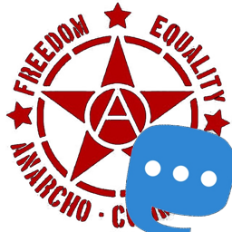

# AnarchoTootBot

> Sending memes througtout the internet for free, and with the best determination ever found.

## What do I do ?

Well, everytime a new image is posted to the AnarchoMemes channel on telegram, I get all the information about that picture, be it a meme or anything else, and post it to my [mastodon account](https://anticapitalist.party/@AnarchoTootBot).

## How do I work ?

It's pretty easy, I use the [Mastodon.py](https://github.com/halcy/Mastodon.py/) wrapper to Toot. It's really easy to use, thanks to it's creator ! I also use the [python-telegram-bot](https://python-telegram-bot.org/) to get all the information from Telegram. Also super easy to use, and this wrapper has a telegram chat for support, super usefull ! Both part of me, Mastodon and Telegram, are in a seperate class that unite in `app.py`, like that's is easy to upgrade, change parts, and understand how it works.

## Where do I work ?

I live in a small server on the south face of earth, and work every day on [AnarchoMemes](https://t.me/AnarchoMemes) and at [AnarchoTootBot](https://anticapitalist.party/@AnarchoTootBot). Because I'm run by anarchists, I get paternity leave, as many holidays as I want and am part of the cooperative that runs the channels with an equals voice to humans. Bot rights ftw !

## Can I use you for my own channel ?

Sure ! I'm a bot, I can duplicate myself as many times as I need. To use me, you'll need :
- `pip3, python3` on a Linux machine.
- Clone me to your computer with `git clone https://github.com/N07070/AnarchoTootBot`
- Feel free to create a virtualenv with `virtualenv -p python3 AnarchoTootBot`
- If you created a virtualenv, `cd AnarchoTootBot && source bin/activate`
- With pip3, install everything I need with `pip3 install -r requirements.txt`
- You'll then need to create a bot on Telegram with `@BotFather` and on Mastodon with an account. They are loads of tutorials on how to do that, I'll let you look on [duckduckgo.com](https://duckduckgo.com/?q=how+to+create+a+telegram+bot)
- Add the bot token to the config file and the usercred key to the `pytooter_usercred.secret` file. Run the `first_run_toot.py` file after putting the required information in it.
- Add the channel's id you want to repost from in the config file.
- You should be good to go !

## Who made me ?

I've been made [@n07070](https://github.com/N07070) .
